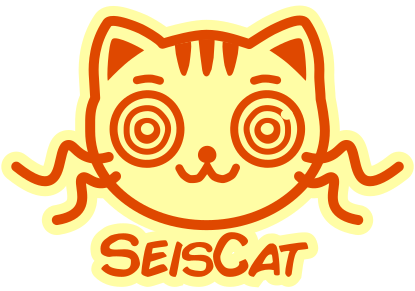

# SeisCat

Keep a local seismic catalog.

[![changelog-badge]][changelog-link]
[![PyPI-badge]][PyPI-link]
[![license-badge]][license-link]
[![docs-badge]][docs-link]
[![DeepWiki-badge]][DeepWiki-link]
[![codecov-badge]][codecov-link]
[![DOI-badge]][DOI-link]

Copyright (c) 2022-2026 Claudio Satriano <satriano@ipgp.fr>

## Overview

SeisCat is a command-line tool to build, maintain, and query a local seismic
catalog.

It builds and updates the catalog from FDSNWS event web services or local
event files. Input formats include CSV and any format handled by ObsPy
(QuakeML, SC3ML, NLLOC, etc.). The catalog is stored in a SQLite
single-file database and can be used as a basis for further analysis.

SeisCat also provides tools to plot and export the catalog, fetch waveforms
and station metadata for catalog events, and run user-defined scripts on those
events.

👇  See below on how to [install](#installation) and
[get started](#getting-started).

📖 Check out the [official documentation][docs-link].

## Getting Started

To get help:

    seiscat -h

First thing to do is to generate a sample configuration file:

    seiscat sampleconfig

Then, edit the configuration file and init the database:

    seiscat initdb

Alternatively, you can init the database from an event file (CSV, QuakeML,
SC3ML, NLLOC, etc.):

    seiscat initdb -f /path/to/your/catalog.csv
    seiscat initdb -f /path/to/your/events.xml

To update an existing database from an FDSN webservice, run:

    seiscat updatedb

(This will use the configuration parameter `recheck_period` to recheck the
last *n* days or hours).

Alternatively, you can update the database from an event file:

    seiscat updatedb -f /path/to/your/catalog.csv
    seiscat updatedb -f /path/to/your/events.xml

You can edit the attributes of specific events in the database using:

    seiscat editdb

You can print the catalog to screen:

    seiscat print

Or plot it:

    seiscat plot

Each of the above commands can have its own options.
As an example, to discover the options for the `plot` command, try:

    seiscat plot -h

To enable command line tab completion run:

    seiscat self completion install

## Installation

### Recommended installation (system tool)

The easiest and recommended way to install **SeisCat** is as a system tool
using the official installation script. This installs SeisCat independently of
your system Python (if any) and manages it via [uv][uv-link].

#### Linux & macOS

Run one of the following commands:

    bash -c "$(curl -fsSL https://raw.githubusercontent.com/SeismicSource/seiscat/refs/heads/main/scripts/install_seiscat_uv.sh)"

or:

    bash -c "$(wget https://raw.githubusercontent.com/SeismicSource/seiscat/refs/heads/main/scripts/install_seiscat_uv.sh -O -)"

#### Windows (PowerShell)

Run the following command in PowerShell:

    powershell -ExecutionPolicy ByPass -c "irm https://raw.githubusercontent.com/SeismicSource/seiscat/refs/heads/main/scripts/install_seiscat_uv.ps1 | iex"

### Updating SeisCat

Once installed as a system tool, SeisCat can be updated directly:

    seiscat self update

To switch to the development version:

    seiscat self update --git

For alternative installation methods (pip, development snapshots, releases,
and editable source installs), see the [full installation documentation][full-installation-docs-link].

## Getting Help / Reporting Bugs

### 🙏 I need help

Please open an [Issue][Issues].

### 🐞 I found a bug

Please open an [Issue][Issues].

## Contributing

I'm very open to contributions: if you have new ideas, please open an
[Issue][Issues].
Don't hesitate sending me pull requests with new features and/or bugfixes!

<!-- Badges and project links -->
[changelog-badge]: https://img.shields.io/badge/Changelog-136CB6.svg
[changelog-link]: CHANGELOG.md
[PyPI-badge]: http://img.shields.io/pypi/v/seiscat.svg
[PyPI-link]: https://pypi.python.org/pypi/seiscat
[license-badge]: https://img.shields.io/badge/license-GPLv3-green
[license-link]: https://www.gnu.org/licenses/gpl-3.0.html
[docs-badge]: https://readthedocs.org/projects/seiscat/badge/?version=latest
[docs-link]: https://seiscat.readthedocs.io/en/latest/?badge=latest
[DOI-badge]: https://zenodo.org/badge/DOI/10.5281/zenodo.19596891.svg
[DOI-link]: https://doi.org/10.5281/zenodo.19596891
[Issues]: https://github.com/SeismicSource/seiscat/issues
[codecov-badge]: https://codecov.io/github/SeismicSource/seiscat/graph/badge.svg?token=X0Z60185PC
[codecov-link]: https://codecov.io/github/SeismicSource/seiscat
[DeepWiki-badge]: https://deepwiki.com/badge.svg
[DeepWiki-link]: https://deepwiki.com/SeismicSource/seiscat

<!-- Other links -->
[uv-link]: https://docs.astral.sh/uv/
[full-installation-docs-link]: https://seiscat.readthedocs.io/en/latest/installation.html
